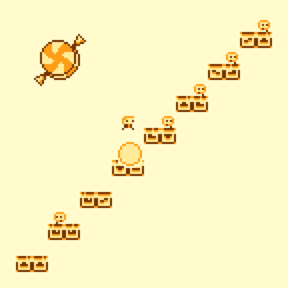

#  Everlasting Candy

Looping arcade platformer game, based on [Candy Wrapper] by [Harmony Honey]

## About

Everlasting Candy is an open source platform game built with [Godot Engine 4.3](https://godotengine.org). It embodies simplicity, it is a little unconventional and includes a touch of harshness with its visual design and gameplay.

Compared to the original [Candy Wrapper], this version has been adapted to permit expansions from aspiring game builders. Contributors can design their own worlds (sequences of levels) and have them included alongside the original headline game. We'll also consider contributions to the game engine and original content provided they maintain the spirit of the project.

This project is used within [Endless learning initiatives](https://www.endlessos.org/game-making) which aim to build career-readiness and collaboration skills through game making. We hope to foster a lasting community of open source game developers who can continuously build and improve games while learning new skills and sharpening existing ones. Everlasting Candy acts as an arena for participants to practice basic usage of the Godot Editor, and gain experience in contributing to a community project via Git and GitHub.

## More Info

* [World Building Guide](doc/WorldBuilding.md)
* [Game Design Document](doc/GameDesign.md)

## License & Credits

Licensed under The Unlicense; see [LICENSE](LICENSE) for more information.

Original game by [Harmony Honey].

[Border Basic](https://v3x3d.itch.io/border-basic) font by VEXED, used under Creative Commons Attribution v4.0 International license.

[m3x6](https://managore.itch.io/m3x6) font by Daniel Linssen.

`icebreak.ogg` based on
[Glass_Shards_Impact_05](https://freesound.org/people/BlondPanda/sounds/778608/)
by [BlondPanda](https://freesound.org/people/BlondPanda/), used under
[Creative Commons 0](http://creativecommons.org/publicdomain/zero/1.0/) license.

[Candy Wrapper]: https://github.com/HarmonyHoney/CandyWrapper
[Harmony Honey]: https://github.com/HarmonyHoney
